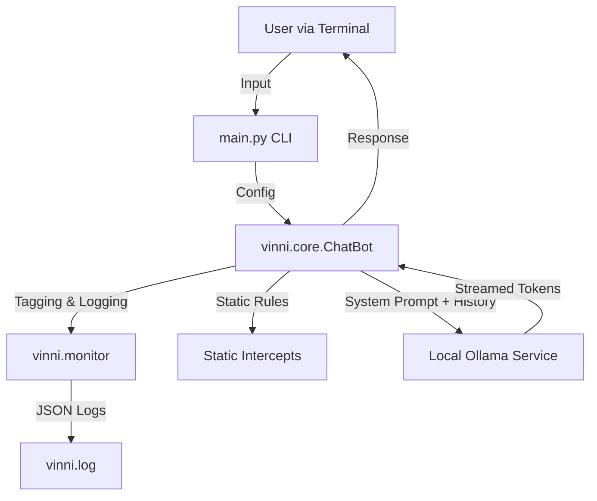

# ViNNi Documentation & Architecture

This document provides an overview of internal architecture, file structure, and the development history of the ViNNi project.

## Architecture Overview

ViNNi follows a simple, modular client-server architecture where the Python application acts as the client and Ollama acts as the local inference server.

### Components
1.  **Frontend (CLI)**: `main.py` handles user interaction, model selection, and printing tokens/intents.
2.  **Logic Layer**: `vinni.core.ChatBot` manages state, session IDs, and static intercepts for meta-questions.
3.  **Observability**: `vinni.monitor` handles Intent Tagging (heuristic) and structured Audit Logging.
4.  **Backend**: Local Ollama instance running the LLMs (`llama3.1`, `qwen2.5`).

## File Structure

- **`main.py`**: Entry point. Displays menu, loads v0.1.3 prompt, runs chat loop.
- **`vinni/core.py`**: Core ChatBot class.
    - Manages `session_id` and history.
    - Implements static response logic ("Who created you?").
    - Estimates token usage.
- **`vinni/monitor.py`**:
    - `IntentTagger`: Tags inputs (CHAT, CODE, ANALYSIS, DOCUMENT).
    - `SecurityLogger`: Writes structured JSON events to `vinni.log`.
- **`prompts/`**:
    - `system_v0.1.2.md`: The locked, production-ready system prompt.
- **`tests/`**:
    - `regression_v02_0.py`: Consolidated regression suite.

## Change Log

### v0.9.0: Trust & Transparency
- **Goal**: Add Confidence Scoring, Assumptions, and Regression Snapshots.
- **Changes**:
    - **Core**: Track assumptions during extraction (e.g. "Defaulted to Monthly Compounding").
    - **Core**: Inject instructions for "TL;DR" vs "Detail" structure.
    - **Core**: Append "Confidence: 1.0 (Deterministic Math)" footer.
    - **Snapshot**: Saves JSON snapshots of math interactions to `tests/snapshots/`.

### v0.8.0: Advanced Finance Features
- **Goal**: Support Canadian Mortgages (Semi-Annual Compounding) and Voluntary Extra Payments.
- **Changes**:
    - **Math Engine**: Restored `compounding_freq` support (Effective Rate: $(1+r/c)^{c/p}-1$).
    - **Math Engine**: Added `extra_payment` logic (Recalculates Payoff Time & Interest Saved).
    - **Core**: Detects "Canadian" (sets semi-annual) and extracts "Extra Payment".
    - **Result**: Precise Canadian mortgage math and payoff scenarios.

### v0.7.1: Routing Logic Fix
- **Goal**: Fix static trigger loop ("Canadian convention" triggering "Capabilities").
- **Changes**:
    - **Core**: Tightened `static_response` trigger trigger to strictly match help phrases, removing loose `and` logic.
    - **Result**: Routing loop resolved; "Canadian" queries now correctly route to Math Engine.

### v0.7.0: Finance Multi-Scenario Context
- **Goal**: Prevent comparisons hallucination by automatically calculating comparison scenarios.
- **Changes**:
    - **Core**: For `loan` queries, `_process_math_request` now injects a `scenarios` dictionary including `PRIMARY`, `CONTEXT_MONTHLY`, and `CONTEXT_BIWEEKLY`.
    - **Verifier**: Updated MV-023 to reject "13 periods" hallucination.
    - **Result**: Complex multi-part queries like "Part d) Bi-weekly?" now use pre-calculated deterministic comparisons.

### v0.6.0: MathVerifier Rule Table (v1.0)
- **Goal**: Implement deterministic Rule Table (MV-XXX) for strict finance/math validation.
- **Changes**:
    - **Verifier**: Implemented Rules MV-012 (Simple Interest), MV-023 (Bi-weekly), MV-040/041 (Invariants), MV-050 (Dominance), MV-060 (Sanity Bounds).
    - **Verifier**: Returns `rule_id` and `severity`.
    - **Core**: Displays warning: `⚠️ [MathVerifier] MV-XXX (HARD): ...`.
    - **Result**: Automated rejection of invalid finance calculations.

### v0.5.1: Finance Invariants & Safety
- **Goal**: Prevent logical fallacies in multi-scenario finance queries.
- **Changes**:
    - **Verifier**: Added Invariant Checks (Total ~= Payment * N) and Dominance Rules (Higher Freq != Higher Interest).
    - **Core**: Enhanced MathVerifier warning to be "CRITICAL ERROR" and append to response.
    - **Result**: "Bi-weekly increases interest" hallucinations are now strictly blocked/flagged.

### v0.5.0: Finance Hardening & Reliability
- **Goal**: Resolve conceptual finance errors (Engine Bypass, Hallucination) and enforce strict math verification.
- **Changes**:
    - **Core**: Removed `ANALYSIS` intent exclusion for triggers; Finance keywords ALWAYS invoke the Math Engine.
    - **Core**: Added strict Parameter Validation (blocks zero-principal queries).
    - **Verifier**: Added Deterministic Rules to reject "Simple Interest" logic in Loans and "24 payments" for Bi-weekly.
    - **Engine**: Validated Effective Rate and Frequency logic.
    - **Result**: Correctly handles "Semi-Annual Compounding / Monthly Payment" and "Bi-weekly" (26 payments) scenarios without hallucination.

### v0.4.2: Finance Engine Upgrade
- **Goal**: Fix Loan Calculation logic for mismatched compounding (Effective Rate).
- **Changes**:
    - **Math Engine**: Updated `calculate_loan_interest` to support `compounding_freq` and use Effective Rate formula ($r_{eff}$).
    - **Core**: Added Robust JSON extraction (substring finder) and `compounding_freq` support.
    - **Result**: Correctly handles "Annual Compounding / Biweekly Payment" scenarios (eliminating phantom monthly calc).

### v0.4.1: Finance Logic Fix
- **Goal**: Ensure Investment queries (Compound Interest) trigger the Math Engine.
- **Changes**:
    - **Trigger Update (`core.py`)**: Added `invest`, `compound`, `growth`, `rate`, `%`.
    - **Extraction Force**: If extraction returns "unknown" for investment queries, force `compound_interest`.
- **Result**: `$1000 at 5%` triggers engine and calculates correct 1628.89.

### v0.4.0: MathVerifier & Gates
- **Goal**: Hardening reliability via Gates and Post-Verification.
- **Changes**:
    - **MathVerifier (`vinni/verifier.py`)**: New Agent checks answers for logic/formula errors.
    - **Ambiguity Gate (`core.py`)**: Explicitly blocks ambiguous Blackjack queries ("Sum to 21") -> Forces Clarification.
    - **Finance Engine**: Added `compound_interest` and `simple_interest` (Fixes $1000 at 5% hallucination).
- **Result**: Traps caught, Compound Interest deterministic.

### v0.3.2: Math Reasoning Refinement
- **Goal**: Stop "Over-classification" (using Combinations for simple probability) and respect Ambiguity.
- **Changes**:
    - **Prompt Engineering**: Added "Direct Probability" vs "Counting" decision tree. Enforced "Ambiguity Trap" (Ask don't guess).
    - **Routing**: Bypassed Math Engine for "Blackjack Sum" queries to allow clarifying questions.
- **Result**: Dice/Coin queries use Enumeration. Trap queries ask for info.

### v0.3.1: Math Engine Tuning
- **Goal**: Fix Intent Routing for generic probability (Coin Flips).
- **Changes**:
    - **Extraction Prompt**: Added `probability_generic` type.
    - **Logic**: Enforced strict whitelist for Engine triggers (`loan`, `annuity`, `bond`, `probability_blackjack`). All others bypass engine.
- **Result**: Coin flips are handled by LLM (Correct), Blackjack by Engine (Correct).

### v0.3.0: Deterministic Math Engine
- **Goal**: Replace LLM arithmetic with Python-based Math Engine (MathVerifier).
- **Architecture**:
    - **Engine**: `vinni/math_engine.py` (Decimal-precision Finance/Prob logic).
    - **Integration**: `core.py` intercepts Math intents, runs extraction, computes result, and injects "GROUND TRUTH" context.
    - **Test Suite**: `tests/test_finance_suite.py` (Gatekeeper).
- **Status**: Logic implemented. LLM adherence tuning in progress.

### v0.2.15: Financial Reliability
- **Goal**: Fix critical interest rate miscalculations.
- **Changes**:
    - **Prompt Rules**: Added strict `FINANCIAL REASONING RULES`.
    - **Sanity Check**: Enforced "Daily Rate < 1%" invariant.
    - **Logic**: Mandated "% -> Decimal" conversion step.
    - **Disclosure**: Forced "ASSUMPTIONS" header for approximations.

### v0.2.14: Precision & Routing
- **Goal**: Fix Permutation vs Combination errors (Lock Codes).
- **Changes**:
    - **Logic**: Replaced blanket "Use C(n,k)" with a explicit Decision Tree (Order? Repeats?).
    - **Routing**: Enforced `MATH -> ANALYSIS` intent mapping.
    - **UX**: Shortened default Greetings.

### v0.2.13: Math Correctness Repair
- **Goal**: Fix domain hallucinations (Blackjack 2 vs 4 cards).
- **Changes**:
    - **Prompt Engineering**: Added explicit Few-Shot example for Blackjack math.
    - **Logic**: Enforced "Definitions First" reasoning (Hand Size, Sample Space, Targets).
    - **Feature**: Added "Answer Only" bypass triggering (e.g. "just answer").

### v0.2.12: Medical Disclaimer Optimization
- **Goal**: Minimize friction for general wellness queries.
- **Changes**:
    - **Policy**: Explicitly forbids disclaimers for general nutrition/fitness.
    - **Trigger**: Disclaimers only appear for specific treatment/diagnosis advice.
    - **Format**: Single-sentence footer (no preachy intros).

### v0.2.11: Persona Unification
- **Goal**: Ensure consistent voice across ALL intents.
- **Changes**:
    - **Global Anchor**: Added "Clear, calm, friendly, precise — never overly verbose, never robotic" to System Prompt `CORE IDENTITY`.
    - **Outcome**: `ANALYSIS` and `MATH` retain a friendly human touch while remaining structured.

### v0.2.10: Verbosity Tuning
- **Goal**: Tune response length per intent, fixing overly verbose Math explanations.
- **Changes**:
    - **Prompt Refinement**: Added `RESPONSE RULES` for specific intents.
        - `CHAT`: Short.
        - `MATH`: Executive Summary (Result + Formula only).

### v0.2.9: Math Reasoning Guardrail
- **Goal**: Fix silent correctness bugs in probability/math reasoning.
- **Changes**:
    - **Prompt Engineering**: Added `MATH REASONING RULES` to system prompt.
    - **Logic**: Enforces standard combinatorial formulas (e.g., C(n,k)) for card games/selection problems.

### v0.2.8: Dynamic Tone Module
- **Goal**: User-controlled and context-aware styling.
- **Changes**:
    - **Logic**: `ChatBot.set_tone()` dynamically injects style instructions into the system prompt.
    - **Modes**: `CASUAL` (Friendly), `PROFESSIONAL` (Academic), `EXECUTIVE` (Bullet points), `ADAPTIVE` (Default).
    - **CLI**: `!tone` command for runtime switching.

### v0.2.7: Adaptive Tone
- **Goal**: More engaging, casual conversational experience.
- **Changes**:
    - **System Prompt v0.2.7**: Explicit instructions for `CHAT` to be short and casual.
    - **Defaults**: `main.py` uses v0.2.7 prompt by default.

### v0.2.6: Performance Analytics
- **Goal**: Visualize system efficiency.
- **Tool**: `scripts/analyze_metrics.py` parses logs to compute:
    - Cache Hit Ratio.
    - Latency Speedup (Hit vs Miss).
    - Top Frequent Queries.

### v0.2.5: Stale Cache Prevention
- **Goal**: Ensure cache validity after model/prompt updates.
- **Changes**:
    - **Composite Keys**: Cache keys now include `md5(input + model_name + prompt_hash)`.
    - **Automatic Invalidation**: Changing the system prompt automatically invalidates old cache entries.

### v0.2.4: Segmented Caching
- **Goal**: Optimize memory usage for specific intents.
- **Changes**:
    - **Intent-Based Storage**: Caches are now segregated (`CHAT`, `CODE`, `ANALYSIS`, `DOCUMENT`).
    - **Dynamic Limits**: Higher capacity for small/frequent `CHAT` (100) vs heavy `ANALYSIS` (20).

### v0.2.3: Logging Polish
- **Goal**: Improved log analytics and ease of parsing.
- **Changes**:
    - Flattened critical metrics (`intent`, `confidence`, `cache_hit`, `input_hash`) to top-level JSON fields.
    - Added MD5 `input_hash` for query analytics.

### v0.2.2: Response Caching
- **Goal**: Reduce latency for repeated identical queries.
- **Changes**:
    - **Caching**: Added LRU-style in-memory cache (Max 50 items).
    - **Optimization**: Near-zero latency for repeated static or generative prompts.
    - **Observability**: Added `cache_hit` flag to logs.

### v0.2.1: Enhanced Logging
- **Goal**: Compliance with structured audit requirements.
- **Changes**:
    - Added `response_summary` (truncated output) to `vinni.log`.
    - Added full `text` output to logs for deeper local debugging.

### v0.2.0: UX & Governance
- **Goal**: Add user-facing commands and establish legal/security framework.
- **Changes**:
    - **CLI**: Added `!help` and `!version` command intercepts (Zero Latency).
    - **Governance**: Added `SECURITY.md`, `CONTRIBUTING.md`, `LICENSE.md`.
    - **Testing**: Unified regression suite covering all 4 intents (including new `DOCUMENT` intent).

### v0.1.5: Polish
- **Goal**: Consistency and Intent Tuning.
- **Changes**:
    - Version injection via `vinni/__init__.py`.
    - Smart Fallback for low confidence (< 0.6).
    - Tuned `ANALYSIS` vs `CODE` routing.

### v0.1.3: Observability Layer
- **Goal**: Full visibility into system performance and usage.
- **Changes**:
    - Added `session_id` to `vinni.core` and logs.
    - Expanded `vinni.log` schema with version tracking and token estimates.
    - Fixed CLI token counting bug.
    - Added static intercept for "Who created you?".

### v0.1.2: Standardization (Locked)
- **Goal**: Prevent drift and ensure predictable behavior.
- **Changes**:
    - **Prompt**: Locked to `system_v0.1.2.md` with strict rules.
    - **Capabilities**: Hard-coded static response for "What can you do?".
    - **Identity**: Enforced via prompt template.

### v0.1.0/v0.1.1: Foundation & Refinement
- **Goal**: Establish Core Contract and Intent Tagging.
- **Changes**: 
    - Created `CONTRACT.md`.
    - Implemented Intent Tagging (`monitor.py`).
    - Fixed greeting tagging ("How are you" -> CHAT).

