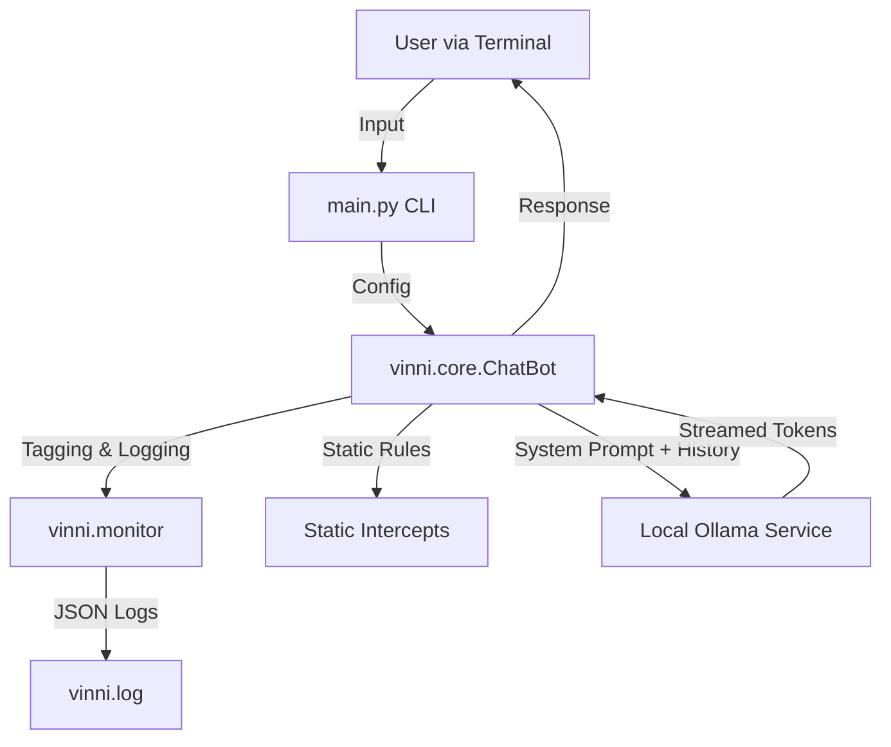

# ViNNi Documentation & Architecture

This document provides an overview of internal architecture, file structure, and the development history of the ViNNi project.

## Architecture Overview

ViNNi follows a simple, modular client-server architecture where the Python application acts as the client and Ollama acts as the local inference server.

### Components
1.  **Frontend (CLI)**: `main.py` handles user interaction, model selection, and printing tokens/intents.
2.  **Logic Layer**: `vinni.core.ChatBot` manages state, session IDs, and static intercepts for meta-questions.
3.  **Observability**: `vinni.monitor` handles Intent Tagging (heuristic) and structured Audit Logging.
4.  **Backend**: Local Ollama instance running the LLMs (`llama3.1`, `qwen2.5`).

## File Structure

- **`main.py`**: Entry point. Displays menu, loads v0.1.3 prompt, runs chat loop.
- **`vinni/core.py`**: Core ChatBot class.
    - Manages `session_id` and history.
    - Implements static response logic ("Who created you?").
    - Estimates token usage.
- **`vinni/monitor.py`**:
    - `IntentTagger`: Tags inputs (CHAT, CODE, ANALYSIS, DOCUMENT).
    - `SecurityLogger`: Writes structured JSON events to `vinni.log`.
- **`prompts/`**:
    - `system_v0.1.2.md`: The locked, production-ready system prompt.
- **`tests/`**:
    - `regression_v02_0.py`: Consolidated regression suite.

## Change Log

### v0.2.3: Logging Polish
- **Goal**: Improved log analytics and ease of parsing.
- **Changes**:
    - Flattened critical metrics (`intent`, `confidence`, `cache_hit`, `input_hash`) to top-level JSON fields.
    - Added MD5 `input_hash` for query analytics.

### v0.2.4: Segmented Caching
- **Goal**: Optimize memory usage for specific intents.
- **Changes**:
    - **Intent-Based Storage**: Caches are now segregated (`CHAT`, `CODE`, `ANALYSIS`, `DOCUMENT`).
    - **Dynamic Limits**: Higher capacity for small/frequent `CHAT` (100) vs heavy `ANALYSIS` (20).

### v0.2.5: Stale Cache Prevention
- **Goal**: Ensure cache validity after model/prompt updates.
- **Changes**:
    - **Composite Keys**: Cache keys now include `md5(input + model_name + prompt_hash)`.
    - **Automatic Invalidation**: Changing the system prompt automatically invalidates old cache entries.

### v0.2.2: Response Caching
- **Goal**: Reduce latency for repeated identical queries.
- **Changes**:
    - **Caching**: Added LRU-style in-memory cache (Max 50 items).
    - **Optimization**: Near-zero latency for repeated static or generative prompts.
    - **Observability**: Added `cache_hit` flag to logs.

### v0.2.1: Enhanced Logging
- **Goal**: Compliance with structured audit requirements.
- **Changes**:
    - Added `response_summary` (truncated output) to `vinni.log`.
    - Added full `text` output to logs for deeper local debugging.

### v0.2.0: UX & Governance
- **Goal**: Add user-facing commands and establish legal/security framework.
- **Changes**:
    - **CLI**: Added `!help` and `!version` command intercepts (Zero Latency).
    - **Governance**: Added `SECURITY.md`, `CONTRIBUTING.md`, `LICENSE.md`.
    - **Testing**: Unified regression suite covering all 4 intents (including new `DOCUMENT` intent).

### v0.1.5: Polish
- **Goal**: Consistency and Intent Tuning.
- **Changes**:
    - Version injection via `vinni/__init__.py`.
    - Smart Fallback for low confidence (< 0.6).
    - Tuned `ANALYSIS` vs `CODE` routing.

### v0.1.3: Observability Layer
- **Goal**: Full visibility into system performance and usage.
- **Changes**:
    - Added `session_id` to `vinni.core` and logs.
    - Expanded `vinni.log` schema with version tracking and token estimates.
    - Fixed CLI token counting bug.
    - Added static intercept for "Who created you?".

### v0.1.2: Standardization (Locked)
- **Goal**: Prevent drift and ensure predictable behavior.
- **Changes**:
    - **Prompt**: Locked to `system_v0.1.2.md` with strict rules.
    - **Capabilities**: Hard-coded static response for "What can you do?".
    - **Identity**: Enforced via prompt template.

### v0.1.0/v0.1.1: Foundation & Refinement
- **Goal**: Establish Core Contract and Intent Tagging.
- **Changes**: 
    - Created `CONTRACT.md`.
    - Implemented Intent Tagging (`monitor.py`).
    - Fixed greeting tagging ("How are you" -> CHAT).

