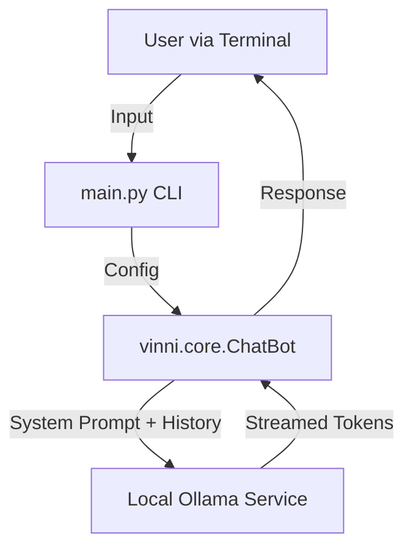

# ViNNi Documentation & Architecture

This document provides an overview of internal architecture, file structure, and the development history of the ViNNi project.

## Architecture Overview

ViNNi follows a simple, modular client-server architecture where the Python application acts as the client and Ollama acts as the local inference server.

### Components
1.  **Frontend (CLI)**: `main.py` handles user interaction, model selection menu, and printing streamed responses.
2.  **Logic Layer**: `vinni.core.ChatBot` encapsulates the state (conversation history), configuration (model options), and communication with the Ollama API.
3.  **Backend**: Local Ollama instance running the LLMs (`llama3.1`, `qwen2.5`).

## File Structure

- **`main.py`**: The entry point.
    - Displays the startup menu.
    - Defines model configurations (Context, Temperature, Top-P).
    - Injects the "System Prompt" to define ViNNi's identity.
    - Runs the chat loop.
- **`vinni/core.py`**: Core library.
    - `ChatBot` Class:
        - `__init__`: Initializes model name, options, and system prompt.
        - `chat()`: Generator function that streams responses from `ollama.chat`.
- **`requirements.txt`**: Lists python dependencies (`ollama`).
- **`test_identity.py`**: Verification script to ensure the system prompt is working correctly.

## Change Log

### Phase 1: Environment Setup
- **Goal**: Clean start, avoiding previous complexities.
- **Changes**: 
    - Initialized Git repo and `venv`.
    - Installed `ollama` python library.
    - Created basic `ChatBot` class wrapping `ollama.chat`.

### Phase 2: Model Configuration
- **Goal**: Support multiple models and fine-tuning inference.
- **Changes**:
    - **`vinni/core.py`**: Updated `ChatBot` to accept an `options` dictionary dictionary (e.g., `num_ctx`, `temperature`).
    - **`main.py`**: Added a selection menu for:
        - Llama 3.1 (8B) [Pre-configured optimization]
        - Qwen 2.5 (7B) [Default]

### Phase 3: Identity Customization
- **Goal**: Stop the bot from identifying as "Meta AI".
- **Changes**:
    - **`vinni/core.py`**: Added `system_prompt` handling. Puts a specific prompt at the start of the conversation history.
    - **`main.py`**: Defined the persona: *"You are ViNNi... Created by Abhishek Arora"*.
